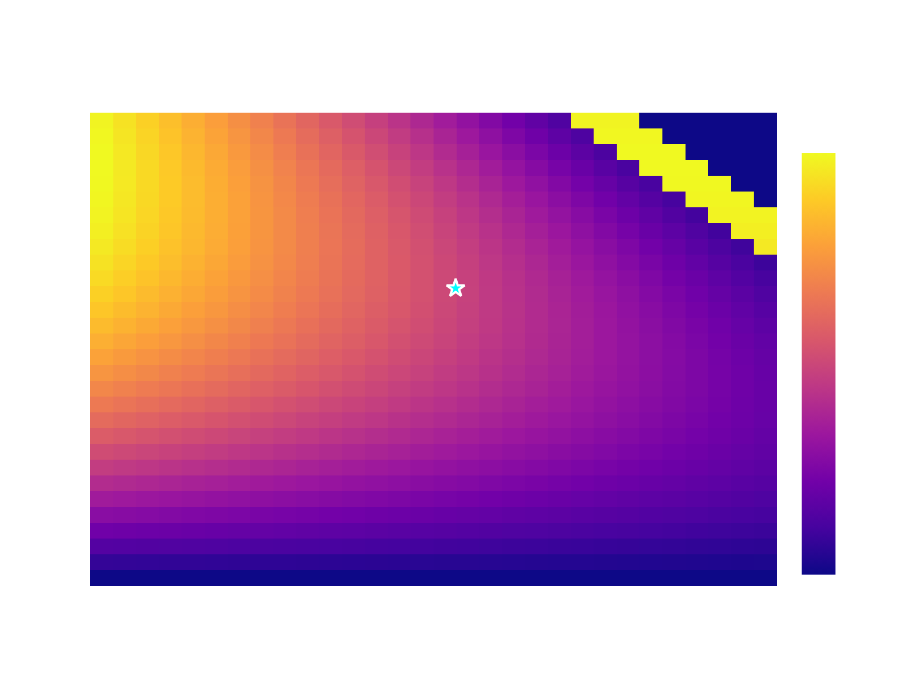

# Oligopoly Simulation

[](https://www.python.org/downloads/)
[](https://opensource.org/licenses/MIT)
[](https://fastapi.tiangolo.com/)
[](https://www.docker.com/)


*Interactive dashboard showing Cournot competition profit surface heatmap with Nash equilibrium visualization*

A comprehensive platform for simulating oligopoly market competition with advanced economic models, learning strategies, and policy analysis capabilities.

## Features

- **Market Competition**: Cournot & Bertrand models with learning strategies and collusion analysis
- **Policy Analysis**: Taxes, subsidies, price caps with event logging and replay
- **Batch Experiments**: Statistical analysis with multiple configurations and CSV export
- **Interactive Dashboard**: Streamlit-based visualization and real-time metrics
- **REST API**: FastAPI with endpoints for simulation, analysis, and data retrieval
- **Database Integration**: PostgreSQL with SQLAlchemy and comprehensive testing

## Quick Start

[](https://colab.research.google.com/github/bangyen/oligopoly/blob/main/oligopoly_demo.ipynb)

### Docker (Recommended)
```bash
# Start all services
docker compose up --build

# Access the application
# API: http://localhost:8000
# Docs: http://localhost:8000/docs
# Dashboard: streamlit run scripts/dashboard.py
```

### Local Development
```bash
# Install dependencies
pip install -e ".[dev]"

# Start database
docker compose up db

# Run migrations
alembic upgrade head

# Start application
uvicorn src.main:app --reload
```

## Usage Examples

### Basic Simulation
```python
from sim.games.cournot import cournot_simulation
from sim.models.models import Demand, Firm

# Define market and firms
demand = Demand(a=100.0, b=1.0)
firms = [Firm(cost=10.0), Firm(cost=15.0)]

# Run simulation
result = cournot_simulation(demand, firms)
print(f"Price: {result.price:.2f}, Profits: {result.profits}")
```

### API Usage
```python
import requests

# Run simulation via API
response = requests.post("http://localhost:8000/simulate", json={
    "model": "cournot",
    "rounds": 10,
    "params": {"a": 100.0, "b": 1.0},
    "firms": [{"cost": 10.0}, {"cost": 15.0}],
    "events": [{"round_idx": 2, "policy_type": "TAX", "value": 0.1}]
})
run_id = response.json()["run_id"]

# Get results and events
results = requests.get(f"http://localhost:8000/runs/{run_id}").json()
events = requests.get(f"http://localhost:8000/runs/{run_id}/events").json()
replay = requests.get(f"http://localhost:8000/runs/{run_id}/replay").json()
```

### Learning Strategies
```python
from sim.strategies.advanced_strategies import FictitiousPlayStrategy
from sim.runners.strategy_runner import run_strategy_game

strategies = [FictitiousPlayStrategy(learning_rate=0.1) for _ in range(2)]
result = run_strategy_game(
    model="cournot", rounds=50, strategies=strategies,
    costs=[10.0, 15.0], params={"a": 100.0, "b": 1.0},
    bounds=(0.0, 50.0), db=db
)
```

### Segmented Demand
```python
# Multi-segment market simulation
response = requests.post("http://localhost:8000/simulate", json={
    "model": "cournot",
    "rounds": 10,
    "firms": [{"cost": 10.0}, {"cost": 15.0}],
    "segments": [
        {"alpha": 200.0, "beta": 1.0, "weight": 0.6},
        {"alpha": 150.0, "beta": 0.8, "weight": 0.4}
    ]
})
```

### Heatmap Generation
```python
# Generate profit surface heatmap
heatmap_response = requests.post("http://localhost:8000/heatmap", json={
    "model": "cournot",
    "firm_i": 0,
    "firm_j": 1,
    "grid_size": 20,
    "action_range": [0.0, 50.0],
    "other_actions": [],
    "params": {"a": 100.0, "b": 1.0},
    "firms": [{"cost": 10.0}, {"cost": 15.0}]
})
```

### Batch Experiments
```bash
# Run experiments with multiple seeds
python experiments/cli.py experiments/sample_config.json --seeds 5

# Use custom configuration
python experiments/cli.py experiments/simplified_config.json --seeds 3 --verbose
```

## Project Structure

```
src/sim/
├── games/           # Cournot, Bertrand, enhanced simulation
├── strategies/      # Nash, learning, collusion strategies  
├── models/          # Economic models, demand functions, metrics
├── runners/         # Simulation orchestrators (basic, strategy, collusion)
├── policy/          # Policy shocks and interventions
├── experiments/     # Batch experiment runner with CSV export
├── events/          # Event logging, replay system, event types
├── heatmap/         # 2D profit surface and market share visualization
├── cli/             # Command-line interfaces
├── validation/      # Input validation and data integrity
└── monitoring.py    # Health checks and metrics collection

scripts/             # Demo and utility scripts
├── dashboard.py     # Streamlit interactive dashboard
├── strategy_demo.py # Learning strategy demonstrations
├── collusion_demo.py # Collusion analysis examples
├── policy_demo.py   # Policy intervention examples
└── enhanced_economics_demo.py # Advanced economic models

experiments/         # Batch experiment system
├── cli.py          # Command-line experiment runner
├── demo.py         # Experiment demonstration
└── sample_config.json # Example experiment configurations

tests/              # Comprehensive test suite
├── unit/           # Unit tests for all modules
├── integration/    # End-to-end workflow tests
└── utils/          # Test utilities and fixtures
```

## Development

```bash
# Setup
make init
source venv/bin/activate

# Code quality
make all  # format, lint, type-check, test

# Docker
make docker     # start all services
make dashboard  # start dashboard
make api        # start API only

# Testing
python -m pytest
python -m pytest --cov=src

# Demos
python scripts/strategy_demo.py
python scripts/collusion_demo.py
make experiments
```

## API Endpoints

- `POST /simulate` - Run simulation (Cournot/Bertrand)
- `GET /runs/{run_id}` - Get simulation results and metrics
- `GET /runs/{run_id}/events` - Get event log for a simulation
- `GET /runs/{run_id}/replay` - Get replay data for playback
- `POST /heatmap` - Generate profit surface heatmaps
- `GET /statistics` - Get application statistics
- `GET /healthz` - Health check

See `/docs` for complete API documentation.

## Batch Experiments

Run statistical experiments with multiple configurations and seeds:

```bash
# Run experiments with 5 seeds per configuration
python experiments/cli.py experiments/sample_config.json --seeds 5
```

Results are exported to CSV files in `/artifacts/` with summary metrics (HHI, consumer surplus, profits).

## Research Applications

- **Academic Research**: Test oligopoly theory predictions
- **Policy Analysis**: Evaluate regulatory interventions
- **Market Analysis**: Understand competitive dynamics
- **Strategy Development**: Test competitive strategies and learning algorithms

## License

MIT License
