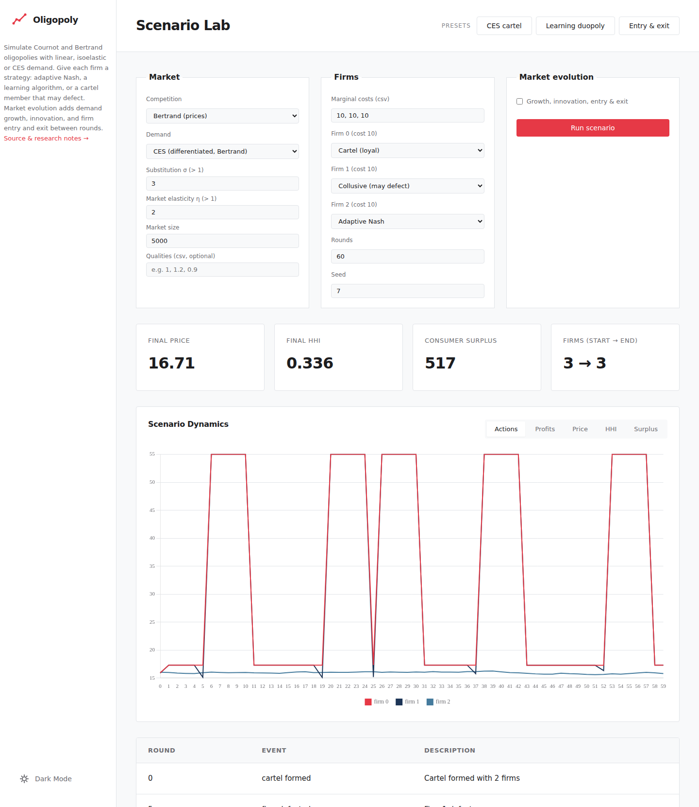

# Oligopoly

[](https://github.com/bangyen/oligopoly/actions/workflows/ci.yml)
[](LICENSE)

**Can pricing algorithms learn to collude, and does it depend on the market?**
This repo is a simulation testbed for oligopoly competition. Cournot and
Bertrand markets with linear, isoelastic or CES demand are played by firms
that learn, collude or best-respond. Every equilibrium is checked against its
closed form.

<p align="center">
  
</p>

## Finding

Following Calvano et al. (2020), two Q-learning firms that remember last
period's prices are trained for about 2 million rounds. Then one is forced to
undercut once. Collusion index Δ: 0 means competitive (Nash) profits, 1 means
joint-monopoly profits.

| Market | Δ with memory | Δ without memory | Deviation punished |
|--------|--------------:|-----------------:|-------------------:|
| Linear Cournot | 0.84 | 0.10 | 8/10 |
| Isoelastic Cournot | 0.84 | 0.06 | 8/10 |
| CES Bertrand | 0.75 | 0.12 | 10/10 |
| Homogeneous Bertrand | 0.88–0.89 | 0.96–0.97 | 8–10/10 |

- **Cournot and CES markets: learned collusion.** Firms sustain near-monopoly
  profits, and a price cut triggers a short price war followed by a return to
  high prices. The collusion disappears when the firms have no memory, so it
  relies on the ability to punish.
- **Homogeneous Bertrand: not collusion.** Firms with no memory, which cannot
  punish, price just as high. The high prices come from how Q-learning stops
  exploring, not from punishment.

Method, per-seed results and impulse responses are in
[docs/learning_benchmarks.md](docs/learning_benchmarks.md).

## Quickstart

```bash
pip install -e .          # core: numpy + SQLAlchemy
pip install -e ".[api]"   # + REST API and Scenario Lab dashboard
```

```python
from sim import ExperimentConfig, build_market, impulse_response, run_experiment

# A differentiated-products (CES) duopoly
market = build_market(
    "bertrand",
    {"demand_type": "ces", "elasticity": 3, "market_elasticity": 2, "market_size": 5000},
    num_firms=2,
)
costs = [10.0, 10.0]
market.nash(costs)  # one-shot Nash prices: [16.67, 16.67]

# Two Q-learners with one-period memory, trained to convergence (~3 s)
result = run_experiment(market, costs, ExperimentConfig(seed=0))
result.collusion_index  # 0.75

# Force a one-period price cut and watch the response
response = impulse_response(market, costs, result)
response.punished, response.deviation_profitable  # (True, False)
```

Multi-round simulations with mixed strategies, policy shocks and market
evolution go through `run_game`. It persists to any SQLAlchemy database, and
SQLite is the default:

```python
from sqlalchemy import create_engine
from sqlalchemy.orm import Session

from sim import get_run_results, run_game
from sim.models.models import Base

engine = create_engine("sqlite://")
Base.metadata.create_all(engine)
with Session(engine) as db:
    run_id = run_game("cournot", 50, {
        "params": {"a": 100, "b": 1},
        "firms": [{"cost": 10}, {"cost": 12}],
        "advanced_strategies": [{"firm_id": 0, "strategy_type": "fictitious_play"}],
    }, db)
    get_run_results(run_id, db)["results"]["49"]  # quantities ≈ Nash (30.7, 28.7)
```

## What's inside

| | |
|---|---|
| **Demand systems** (`sim.markets`) | Linear (optionally segmented), isoelastic, and nested-CES differentiated demand. Each market provides its round engine, Nash equilibrium, best response, joint-profit optimum and welfare metrics. |
| **Firms** | Adaptive Nash; learners (fictitious play, tabular and deep Q-learning, behavioral); collusive firms that form a cartel at the joint-profit optimum, may defect, and re-form after a breakdown. |
| **Dynamics** | Taxes, subsidies and price caps; demand growth, innovation, and firm entry and exit between rounds. |
| **Experiments** (`sim.experiments`) | Long-horizon Q-learning following Calvano et al., with impulse responses and a memoryless control. |
| **Scenario Lab** (`dashboard/`) | Run any configuration in the browser, with presets. Pictured above. |
| **REST API** (`sim.api`) | `POST /simulate`, `POST /compare`, and `GET /runs/{id}`, `/events`, `/replay`. Interactive docs at `/docs`. |

## Correctness

The benchmarks in `tests/benchmarks/` check each market against theory:
- equilibria match their closed forms to 1e-6;
- brute-force searches confirm no firm gains by deviating unilaterally;
- cartels reach the analytic joint-monopoly outcome.

CI runs lint, type checks and tests on Python 3.10–3.12 with at least 85%
coverage. It also verifies that the wheel works without the optional extras,
and runs an end-to-end test of the Docker image.

## Running things

```bash
just init        # install with dev tools (or: pip install -e ".[dev]")
just check       # format check, lint, type check, tests + coverage
just dashboard   # Scenario Lab at http://localhost:5050
just api         # REST API at http://localhost:8000/docs
just benchmarks  # regenerate docs/learning_benchmarks.md results (~10 min)
```

Docker: `just docker-dashboard` builds the image and serves the Scenario Lab.

## Simulation options

`POST /simulate` accepts `model` (`cournot`/`bertrand`), `rounds`, `firms`,
`params`, `segments`, `events` and `seed`, plus:

| Field | Values | Notes |
|-------|--------|-------|
| `demand_type` | `"linear"` (default), `"isoelastic"` | Isoelastic uses `params: {"A", "elasticity"}`, with Q(P) = (A/P)^e |
| `enhanced_demand` | `{"demand_type": "ces", "elasticity", "market_elasticity", "market_size", "qualities"}` | Differentiated Bertrand with nested CES demand |
| `advanced_strategies` | `[{"firm_id", "strategy_type", ...}]` | `fictitious_play`, `q_learning`, `deep_q_learning`, `behavioral`, `cartel`, `collusive`, `opportunistic` |
| `capacity_constraints` | `true` (default), `false` | Linear Bertrand only. `false` removes the 40%-of-market cap for textbook winner-take-all |
| `market_evolution` | `{"growth_rate", "entry_cost", "exit_threshold", "innovation_rate"}` | Entries, exits and innovations appear in `/runs/{id}/events` |

Unknown or contradictory options are rejected with a 422 or a 400 that
explains the problem.

## References

- Calvano, E., Calzolari, G., Denicolò, V. & Pastorello, S. (2020). *[Artificial Intelligence, Algorithmic Pricing, and Collusion](https://www.aeaweb.org/articles?id=10.1257/aer.20190623)*. American Economic Review.
- Asker, J., Fershtman, C. & Pakes, A. (2022). *[Artificial Intelligence, Algorithm Design, and Pricing](https://www.aeaweb.org/articles?id=10.1257/pandp.20221059)*. AEA Papers and Proceedings.
- Cournot, A. (1838). *[Recherches sur les principes mathématiques de la théorie des richesses](https://gallica.bnf.fr/ark:/12148/bpt6k6117257c)*
- Bertrand, J. (1883). *[Théorie mathématique de la richesse sociale](https://en.wikipedia.org/wiki/Bertrand_competition)*

## License

[MIT](LICENSE)
