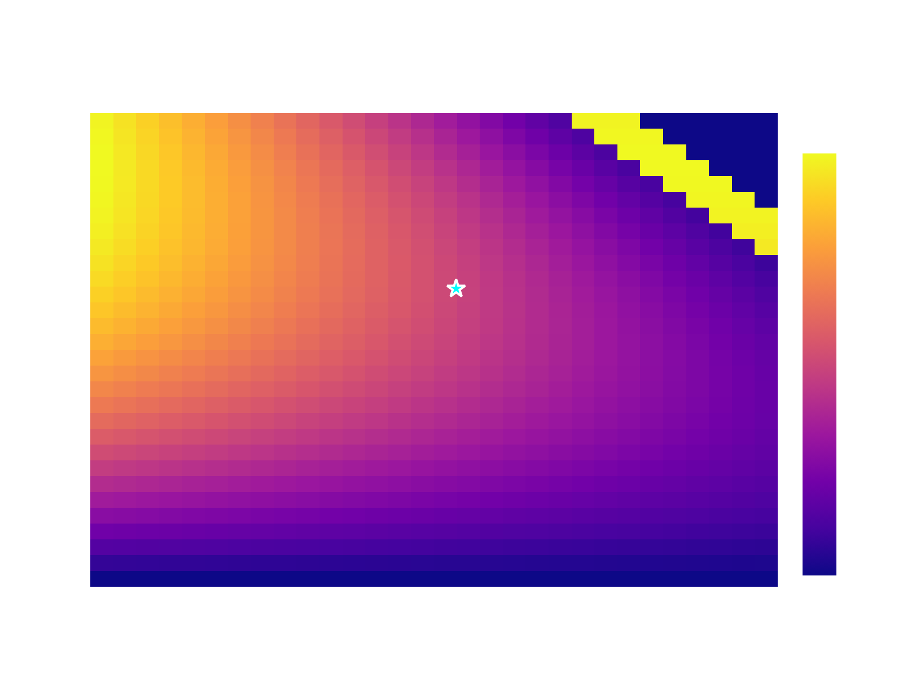

# Oligopoly Simulation

[](https://colab.research.google.com/github/bangyen/oligopoly/blob/main/oligopoly_demo.ipynb)
[](https://github.com/bangyen/oligopoly/actions/workflows/ci.yml)
[](LICENSE)

**Oligopoly market simulation: Cournot and Bertrand competition with learning strategies, collusion detection, and policy shocks**  

<p align="center">
  
</p>

## Quickstart

Clone the repo and initialize the environment:

```bash
git clone https://github.com/bangyen/oligopoly.git
cd oligopoly
just init      # or: pip install -e ".[dev]"
just test      # or: pytest
python -m scripts.strategy_demo
```

Or open in Colab: [Colab Notebook](https://colab.research.google.com/github/bangyen/oligopoly/blob/main/oligopoly_demo.ipynb).

Once installed, the package provides three console scripts:

```bash
oligopoly     # serve the REST API (http://localhost:8000)
cournot       # run a one-off Cournot simulation
bertrand      # run a one-off Bertrand simulation
```

## Results

| Capability | Description |
|------------|-------------|
| Collusion Detection | Flags cartel behavior and defections with a configurable tolerance |
| Equilibria | Linear, isoelastic and CES equilibria match closed forms to 1e-6 ([benchmarks](tests/benchmarks/)) |
| Strategy Adaptation | Firms learn and evolve using Q-learning and Fictitious Play |

Multi-round linear Bertrand runs use a capacity-constrained allocation by
default (each firm can serve at most 40% of the market), so they deliberately
depart from the winner-take-all textbook model that the equilibrium helper and
benchmarks use. Set `capacity_constraints: false` for the textbook game.

## Features

- **Collusion Detection** — Tolerance-based detection of cartel behavior and defections.  
- **Policy Analysis** — Applies taxes, subsidies and price caps mid-simulation.  
- **Demand Systems** — Linear (optionally segmented), isoelastic, and CES differentiated-products demand.  
- **Learning Strategies** — Fictitious play, tabular and deep Q-learning, behavioral, and Tit-for-Tat firms.  
- **Market Evolution** — Demand growth, innovation, and firm entry/exit between rounds.  
- **Interactive Dashboard** — Visualization using FastAPI and Jinja2 templates.  
- **REST API** — Comprehensive FastAPI endpoints for simulation management and analysis.  
- **Batch Experiments** — Reproducible seeded runs with CSV export (plots need `pip install -e ".[viz]"`).  

## Repo Structure

```plaintext
oligopoly/
├── dashboard/           # FastAPI visualization dashboard
├── experiments/         # Batch experiment configurations
├── scripts/             # Demo and utility scripts
├── src/                 # Core implementation
│   ├── sim/             # Simulation engine
│   │   ├── games/       # Cournot & Bertrand models
│   │   ├── strategies/  # Learning algorithms
│   │   ├── policy/      # Tax/subsidy interventions
│   │   ├── markets.py   # Demand systems: round engine, Nash, best response
│   │   └── api/         # FastAPI app: schemas + simulate/runs/heatmap routers
│   └── ...
├── tests/               # Unit, integration and analytic benchmark tests
└── oligopoly_demo.ipynb # Colab notebook demo
```

## Test Locations

Tests mirror the source tree under `tests/unit/`. Non-obvious mappings:

| Source | Tests |
|--------|-------|
| `src/sim/games/` | `tests/unit/games/` |
| `src/sim/strategies/` | `tests/unit/strategies/` |
| `src/sim/policy/` | `tests/unit/policy/` |
| `src/sim/collusion.py` | `tests/unit/runners/` |
| `src/sim/runners/` | `tests/unit/runners/` |
| `src/sim/api/` | `tests/unit/api/` + `tests/integration/` |
| Analytic equilibria | `tests/benchmarks/` |
| `dashboard/main.py` | `tests/unit/heatmap/` + `tests/unit/infrastructure/` |

## Validation

- ✅ Test coverage ≥85%, enforced in CI (`just cov`)
- ✅ Equilibria for every demand system checked against closed forms and brute-force deviations (`tests/benchmarks/`)
- ✅ CI on Python 3.10, 3.11 and 3.12
- ✅ Reproducible seeds for experiments
- ✅ `justfile` for common development tasks

## API Endpoints

- `GET /` - Root API information
- `POST /simulate` - Run Cournot/Bertrand simulation
- `GET /runs` - List simulation runs
- `GET /runs/{run_id}` - Get simulation time-series results
- `GET /runs/{run_id}/detail` - Get detailed run metadata
- `GET /runs/{run_id}/events` - Retrieve all simulation events
- `GET /runs/{run_id}/replay` - Get frame-by-frame replay data
- `POST /compare` - Run scenarios for comparison
- `GET /compare/{left_run_id}/{right_run_id}` - Get aligned comparison results
- `POST /heatmap` - Generate profit surface heatmaps
- `GET /healthz` - Health check endpoint

## Simulation Options

`POST /simulate` (and each side of `POST /compare`) accepts, besides
`model`, `rounds`, `firms`, `params`, `segments`, `events` and `seed`:

| Field | Values | Notes |
|-------|--------|-------|
| `demand_type` | `"linear"` (default), `"isoelastic"` | Isoelastic uses `params: {"A", "elasticity"}` with Q(P) = (A/P)^e |
| `enhanced_demand` | `{"demand_type": "ces", "elasticity", "market_elasticity", "market_size", "qualities"}` | Differentiated Bertrand with nested CES demand: varieties substitute with `elasticity`; group demand is `market_size · P^-market_elasticity` |
| `advanced_strategies` | `[{"firm_id", "strategy_type", ...}]` | Learners: `fictitious_play`, `q_learning`, `deep_q_learning`, `behavioral` (optional `learning_rate`, `memory_length`, `exploration_rate`). Collusion: two or more `cartel`/`collusive`/`opportunistic` firms form a cartel at their joint-profit optimum; a defection breaks it for 5 rounds |
| `capacity_constraints` | `true` (default), `false` | Linear Bertrand only: `false` drops the 40%-of-market cap for textbook winner-take-all |
| `market_evolution` | `{"growth_rate", "entry_cost", "exit_threshold", "innovation_rate"}` | Entries, exits and innovations show up in `/runs/{id}/events` |

```json
{
  "model": "bertrand",
  "rounds": 50,
  "firms": [{"cost": 10}, {"cost": 12}, {"cost": 11}],
  "enhanced_demand": {"demand_type": "ces", "elasticity": 3, "market_size": 300},
  "advanced_strategies": [{"firm_id": 0, "strategy_type": "fictitious_play"}],
  "market_evolution": {"growth_rate": 0.02, "entry_cost": 50},
  "seed": 42
}
```

Firms without an advanced strategy adapt towards the market's Nash
equilibrium each round. Unknown fields are rejected with a 422.

## Roadmap

Known gaps and next steps, roughly in priority order:

- [x] **Collusion everywhere** — cartels form at the members' joint-profit
      optimum in every demand system and survive market evolution.
- [x] **Bertrand capacity toggle** — `capacity_constraints: false` gives the
      textbook winner-take-all game for linear Bertrand runs.
- [x] **CES consumer surplus** — nested CES demand with a finite
      `market_elasticity` gives a closed-form consumer surplus.
- [ ] **Dashboard support** — let the dashboard configure demand types,
      learning strategies and market evolution.
- [ ] **Learning benchmarks** — measure whether each learning strategy
      converges to equilibrium under each demand system.
- [ ] **Docker e2e in CI** — keep the compose-based end-to-end job green.

## References

- Cournot, A. (1838). *[Recherches sur les principes mathématiques de la théorie des richesses](https://gallica.bnf.fr/ark:/12148/bpt6k6117257c)*
- Bertrand, J. (1883). *[Théorie mathématique de la richesse sociale](https://en.wikipedia.org/wiki/Bertrand_competition)*
- Nash, J. (1950). *[Equilibrium points in n-person games](https://www.pnas.org/doi/10.1073/pnas.36.1.48)*

## License

This project is licensed under the [MIT License](LICENSE).
